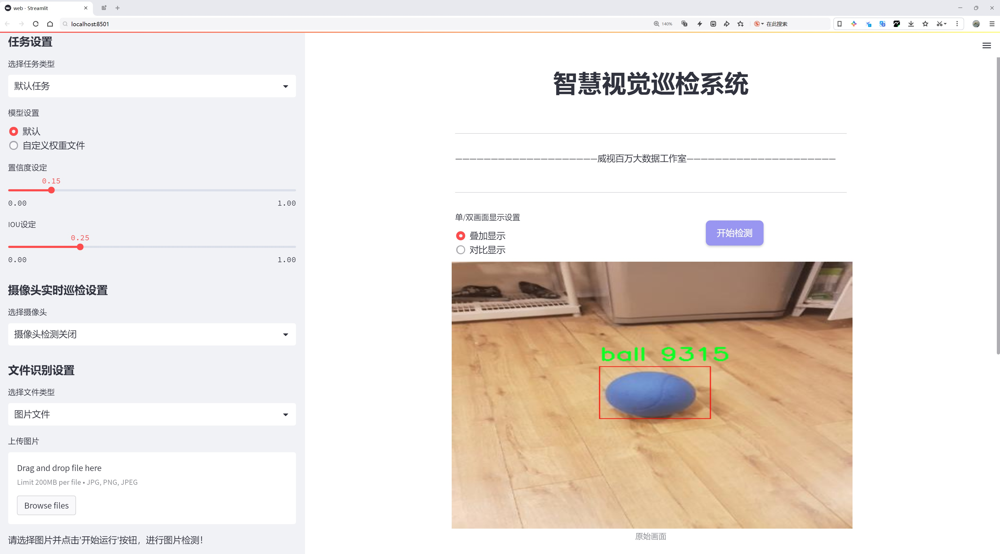
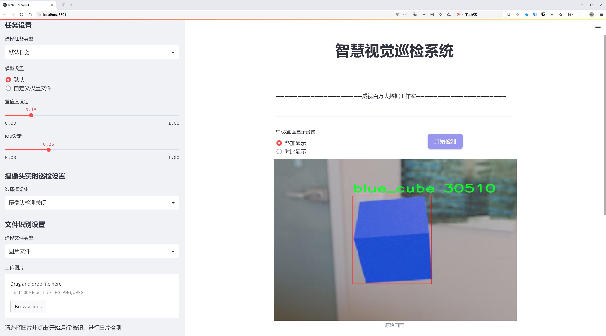
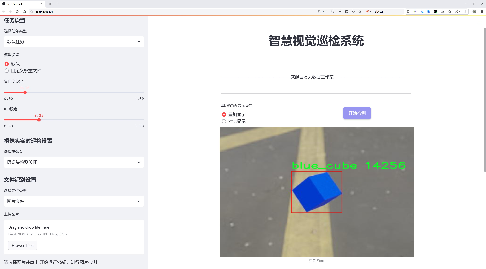
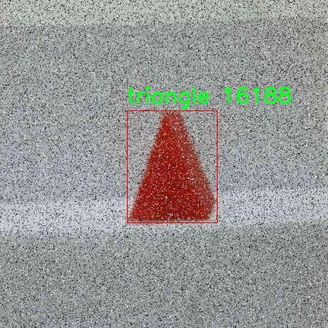
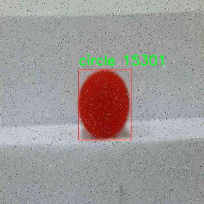
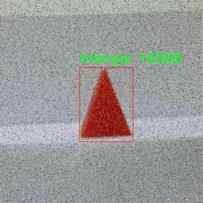
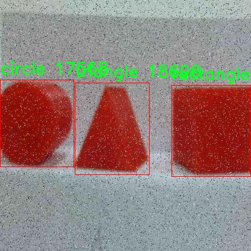
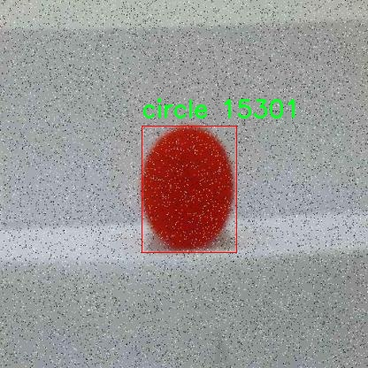

# 三维几何体形状检测检测系统源码分享
 # [一条龙教学YOLOV8标注好的数据集一键训练_70+全套改进创新点发刊_Web前端展示]

### 1.研究背景与意义

项目参考[AAAI Association for the Advancement of Artificial Intelligence](https://gitee.com/qunmasj/projects)

项目来源[AACV Association for the Advancement of Computer Vision](https://kdocs.cn/l/cszuIiCKVNis)

研究背景与意义

随着计算机视觉技术的迅猛发展，物体检测在各个领域的应用愈发广泛，尤其是在智能制造、自动驾驶、机器人导航等场景中，准确识别和定位物体的能力显得尤为重要。传统的物体检测方法多依赖于二维图像特征提取，然而在处理复杂场景或多视角物体时，二维信息的局限性逐渐显露。因此，基于三维几何体形状的检测系统应运而生，成为提升物体识别精度和鲁棒性的关键技术之一。

本研究围绕改进YOLOv8模型，构建一个高效的三维几何体形状检测系统，旨在实现对多种几何形状的精准识别与分类。YOLO（You Only Look Once）系列模型因其高效的实时检测能力和较低的计算复杂度，已成为物体检测领域的主流选择。YOLOv8作为该系列的最新版本，进一步优化了网络结构和训练策略，具备更强的特征提取能力和更快的推理速度。然而，现有的YOLOv8模型在处理三维几何体形状时，仍存在对形状特征提取不足的问题。因此，通过对YOLOv8进行改进，结合三维几何体的特征，能够有效提升模型在复杂场景下的检测性能。

本研究所使用的数据集包含1800张图像，涵盖了9种不同的几何形状，包括立方体、球体、圆形、矩形和三角形等。这些形状在现实世界中广泛存在，且具有不同的颜色和尺寸，能够为模型的训练提供丰富的样本。通过对这些几何体的检测，不仅可以验证改进YOLOv8模型的有效性，还能够为后续的研究提供基础数据支持。此外，数据集中不同类别的几何体形状为模型的多样性和泛化能力提供了良好的训练基础，有助于提升模型在实际应用中的适应性。

研究的意义不仅体现在理论层面，更在于其实际应用价值。通过构建高效的三维几何体形状检测系统，可以为智能制造、自动化仓储、无人驾驶等领域提供技术支持，提升生产效率和安全性。例如，在自动化仓储中，系统能够快速识别和分类不同形状的货物，优化存储布局和拣货流程；在无人驾驶中，系统能够实时识别路面上的各种几何形状，增强车辆的环境感知能力，确保行驶安全。

综上所述，基于改进YOLOv8的三维几何体形状检测系统的研究，不仅具有重要的学术价值，也为相关行业的技术进步提供了有力的支持。通过对三维几何体形状的深入研究，我们期待能够推动物体检测技术的进一步发展，为智能化时代的到来贡献一份力量。

### 2.图片演示







##### 注意：由于此博客编辑较早，上面“2.图片演示”和“3.视频演示”展示的系统图片或者视频可能为老版本，新版本在老版本的基础上升级如下：（实际效果以升级的新版本为准）

  （1）适配了YOLOV8的“目标检测”模型和“实例分割”模型，通过加载相应的权重（.pt）文件即可自适应加载模型。

  （2）支持“图片识别”、“视频识别”、“摄像头实时识别”三种识别模式。

  （3）支持“图片识别”、“视频识别”、“摄像头实时识别”三种识别结果保存导出，解决手动导出（容易卡顿出现爆内存）存在的问题，识别完自动保存结果并导出到tempDir中。

  （4）支持Web前端系统中的标题、背景图等自定义修改，后面提供修改教程。

  另外本项目提供训练的数据集和训练教程,暂不提供权重文件（best.pt）,需要您按照教程进行训练后实现图片演示和Web前端界面演示的效果。

### 3.视频演示

[3.1 视频演示](https://www.bilibili.com/video/BV1qkxveHEQ1/)

### 4.数据集信息展示

##### 4.1 本项目数据集详细数据（类别数＆类别名）

nc: 9
names: ['Cube-silicone', 'ball', 'blue_cube', 'circle', 'green_cube', 'rectangle', 'red_cube', 'triangle', 'yellow_cube']


##### 4.2 本项目数据集信息介绍

数据集信息展示

在现代计算机视觉领域，三维几何体形状检测的研究正逐渐成为一个重要的研究方向。为了有效地训练和优化YOLOv8模型，我们构建了一个名为“3D Geom Shape Detector”的数据集，该数据集专注于九种不同的三维几何体形状。这些形状的多样性不仅丰富了数据集的内容，也为模型的学习提供了广泛的样本，进而提升了其在实际应用中的泛化能力。

该数据集包含九个类别，分别是：Cube-silicone、ball、blue_cube、circle、green_cube、rectangle、red_cube、triangle和yellow_cube。这些类别涵盖了从简单的几何形状到更复杂的结构，能够有效地模拟现实世界中可能遇到的各种物体。每个类别的选择都经过精心设计，以确保数据集的多样性和代表性。例如，Cube-silicone和不同颜色的立方体（如blue_cube、green_cube、red_cube和yellow_cube）不仅展示了形状的相似性，还引入了颜色这一重要特征，帮助模型学习如何在视觉上区分这些物体。

数据集中每个类别的样本数量经过精确控制，以确保模型在训练过程中不会偏向某一特定类别。通过均衡的样本分布，模型能够在各个类别之间进行有效的学习，从而提高其对新样本的识别能力。此外，数据集中的每个样本都经过精细标注，确保在训练过程中模型能够获得准确的位置信息和类别标签。这种高质量的标注为模型的训练提供了坚实的基础，使其能够在复杂的场景中进行准确的物体检测。

在数据集的构建过程中，我们还考虑到了不同光照条件和背景环境对物体检测的影响。数据集中包含了多种光照条件下的样本，以模拟真实世界中可能遇到的各种情况。这种多样化的训练数据使得模型在面对不同环境时，能够保持较高的检测精度和鲁棒性。

此外，数据集的设计还特别关注了物体的尺度变化和视角变化。通过在不同的距离和角度拍摄样本，我们确保模型能够学习到物体在不同情况下的表现。这种对尺度和视角的变化的关注，极大地增强了模型在实际应用中的适应能力，使其能够在各种复杂场景中进行有效的形状检测。

总之，“3D Geom Shape Detector”数据集的构建不仅为YOLOv8模型的训练提供了丰富的样本和多样化的特征，还通过精确的标注和多样的环境设置，确保了模型的高效学习和准确检测。随着三维几何体形状检测技术的不断发展，这一数据集将为相关研究提供重要的支持，推动该领域的进一步探索与创新。











### 5.全套项目环境部署视频教程（零基础手把手教学）

[5.1 环境部署教程链接（零基础手把手教学）](https://www.ixigua.com/7404473917358506534?logTag=c807d0cbc21c0ef59de5)


[5.2 安装Python虚拟环境创建和依赖库安装视频教程链接（零基础手把手教学）](https://www.ixigua.com/7404474678003106304?logTag=1f1041108cd1f708b01a)

### 6.手把手YOLOV8训练视频教程（零基础小白有手就能学会）

[6.1 手把手YOLOV8训练视频教程（零基础小白有手就能学会）](https://www.ixigua.com/7404477157818401292?logTag=d31a2dfd1983c9668658)

### 7.70+种全套YOLOV8创新点代码加载调参视频教程（一键加载写好的改进模型的配置文件）

[7.1 70+种全套YOLOV8创新点代码加载调参视频教程（一键加载写好的改进模型的配置文件）](https://www.ixigua.com/7404478314661806627?logTag=29066f8288e3f4eea3a4)

### 8.70+种全套YOLOV8创新点原理讲解（非科班也可以轻松写刊发刊，V10版本正在科研待更新）

由于篇幅限制，每个创新点的具体原理讲解就不一一展开，具体见下列网址中的创新点对应子项目的技术原理博客网址【Blog】：


[8.1 70+种全套YOLOV8创新点原理讲解链接](https://gitee.com/qunmasj/good)

### 9.系统功能展示（检测对象为举例，实际内容以本项目数据集为准）

图9.1.系统支持检测结果表格显示

  图9.2.系统支持置信度和IOU阈值手动调节

  图9.3.系统支持自定义加载权重文件best.pt(需要你通过步骤5中训练获得)

  图9.4.系统支持摄像头实时识别

  图9.5.系统支持图片识别

  图9.6.系统支持视频识别

  图9.7.系统支持识别结果文件自动保存

  图9.8.系统支持Excel导出检测结果数据


### 10.原始YOLOV8算法原理

原始YOLOv8算法原理

YOLOv8算法是由Glenn-Jocher提出的，作为YOLO系列的最新版本，它在YOLOv3和YOLOv5的基础上进行了多项重要改进，旨在提升目标检测的精度和效率。YOLOv8的设计理念不仅延续了前代模型的优点，还在多个方面进行了创新，使其在计算机视觉领域中脱颖而出。

首先，YOLOv8在数据预处理方面依然采用了YOLOv5的策略，但在具体的增强手段上进行了丰富。数据预处理是模型训练中至关重要的一环，YOLOv8通过马赛克增强、混合增强、空间扰动和颜色扰动等四种增强方式，有效地提升了模型对多样化数据的适应能力。这些增强手段不仅增加了训练数据的多样性，还帮助模型在面对不同场景和条件时，能够更好地进行特征提取和目标识别。

在骨干网络结构方面，YOLOv8的设计灵感源自YOLOv5，但进行了重要的改进。YOLOv5的主干网络通过使用步长为2的3×3卷积进行特征图的降采样，并接入C3模块以强化特征提取。而在YOLOv8中，C3模块被更新为C2f模块，这一新模块通过引入更多的分支，丰富了梯度回传时的支流，增强了特征的表达能力。C2f模块的设计使得网络在特征提取过程中，能够更有效地捕捉到不同层次的特征信息，从而提升了模型的整体性能。

YOLOv8继续采用FPN（特征金字塔网络）和PAN（路径聚合网络）结构，以实现多尺度信息的充分融合。尽管C3模块被替换为C2f模块，但FPN-PAN的整体架构与YOLOv5保持一致。这种结构的设计理念在于通过不同尺度的特征融合，提升模型对小目标的检测能力，同时确保在复杂场景下的高效性。

在检测头的设计上，YOLOv8引入了解耦头的结构，这一结构的创新使得模型在分类和定位任务上能够独立进行处理。与YOLOv3和YOLOv5的耦合头不同，YOLOv8的解耦头通过两条并行分支分别提取类别特征和位置特征，进而通过1×1卷积完成分类和定位任务。这种解耦设计不仅提高了模型的灵活性，还使得模型在处理复杂场景时能够更好地分辨目标的类别和位置。

在标签分配策略方面，YOLOv8的设计考虑到了数据集的多样性和复杂性。尽管YOLOv5引入了自动聚类候选框的功能，但这一方法依赖于数据集的充分性，可能导致聚类结果与真实物体尺寸的偏差。YOLOv8摒弃了候选框策略，采用了TOOD（Target-Object-Oriented Detection）策略进行动态标签分配。这一策略通过仅使用目标框和目标分数，简化了标签分配的过程，使得模型在训练时能够更准确地匹配正负样本。YOLOv8的损失函数主要由类别损失和位置损失组成，其中类别损失采用了VFL（Varifocal Loss），而回归损失则结合了CIoU（Complete Intersection over Union）和DFL（Discriminative Focal Loss）。这种损失函数的设计旨在通过不对称参数对正负样本进行加权，使得模型在训练时能够更关注高质量的正样本，同时降低负样本对损失的影响。

YOLOv8的整体架构和设计理念使其在目标检测任务中展现出卓越的性能。与前代模型相比，YOLOv8在精度和执行速度上均有显著提升，成为计算机视觉领域中最先进的模型之一。其灵活的结构设计和高效的特征提取能力，使得YOLOv8不仅适用于传统的目标检测任务，还能够扩展到实例分割和姿态评估等更复杂的应用场景。

总之，YOLOv8算法通过对数据预处理、骨干网络、特征融合、检测头和标签分配策略等多个方面的创新，构建了一个高效、准确且易于使用的目标检测模型。它不仅继承了YOLO系列的优良传统，还在此基础上进行了全面的提升，使得YOLOv8在各种应用场景中都能展现出卓越的性能，标志着目标检测技术的又一次飞跃。


### 11.项目核心源码讲解（再也不用担心看不懂代码逻辑）

#### 11.1 code\ultralytics\utils\metrics.py

以下是经过精简和注释的核心代码部分，主要集中在计算指标的函数和类上，以便于理解和使用。

```python
import numpy as np
import torch

def box_iou(box1, box2, eps=1e-7):
    """
    计算两个边界框之间的交并比（IoU）。
    
    Args:
        box1 (torch.Tensor): 形状为 (N, 4) 的张量，表示 N 个边界框。
        box2 (torch.Tensor): 形状为 (M, 4) 的张量，表示 M 个边界框。
        eps (float, optional): 避免除以零的小值。默认值为 1e-7。

    Returns:
        (torch.Tensor): 形状为 (N, M) 的张量，包含 box1 和 box2 之间的成对 IoU 值。
    """
    # 获取边界框的坐标
    (a1, a2), (b1, b2) = box1.unsqueeze(1).chunk(2, 2), box2.unsqueeze(0).chunk(2, 2)
    
    # 计算交集区域
    inter = (torch.min(a2, b2) - torch.max(a1, b1)).clamp_(0).prod(2)

    # 计算 IoU
    return inter / ((a2 - a1).prod(2) + (b2 - b1).prod(2) - inter + eps)

class Metric:
    """
    计算 YOLO 模型的评估指标，包括精度、召回率和平均精度（mAP）。
    
    Attributes:
        p (list): 每个类别的精度。
        r (list): 每个类别的召回率。
        all_ap (list): 所有类别和所有 IoU 阈值的 AP 分数。
        nc (int): 类别数量。
    """

    def __init__(self):
        """初始化 Metric 实例。"""
        self.p = []  # 精度
        self.r = []  # 召回率
        self.all_ap = []  # 平均精度
        self.nc = 0  # 类别数量

    def update(self, results):
        """
        更新评估指标。
        
        Args:
            results (tuple): 包含精度、召回率和 AP 分数的元组。
        """
        self.p, self.r, self.all_ap = results

    @property
    def map(self):
        """返回 IoU 阈值为 0.5 到 0.95 的平均精度（mAP）。"""
        return self.all_ap.mean() if len(self.all_ap) else 0.0

class DetMetrics:
    """
    计算目标检测的指标，包括精度、召回率和 mAP。
    
    Attributes:
        box (Metric): 用于存储检测指标的 Metric 实例。
    """

    def __init__(self, names=()):
        """初始化 DetMetrics 实例。"""
        self.box = Metric()  # 创建 Metric 实例
        self.names = names  # 类别名称

    def process(self, tp, conf, pred_cls, target_cls):
        """
        处理预测结果并更新指标。
        
        Args:
            tp (np.ndarray): 真阳性数组。
            conf (np.ndarray): 预测的置信度。
            pred_cls (np.ndarray): 预测的类别。
            target_cls (np.ndarray): 真实类别。
        """
        results = ap_per_class(tp, conf, pred_cls, target_cls)  # 计算每个类别的 AP
        self.box.update(results)  # 更新指标

    @property
    def mean_results(self):
        """返回检测指标的平均值。"""
        return self.box.map  # 返回平均精度

def ap_per_class(tp, conf, pred_cls, target_cls):
    """
    计算每个类别的平均精度（AP）。
    
    Args:
        tp (np.ndarray): 真阳性数组。
        conf (np.ndarray): 预测的置信度。
        pred_cls (np.ndarray): 预测的类别。
        target_cls (np.ndarray): 真实类别。

    Returns:
        (tuple): 包含精度、召回率和 AP 分数的元组。
    """
    # 计算 AP 的逻辑
    # 省略具体实现
    return precision, recall, ap  # 返回精度、召回率和 AP

# 其他函数和类可以根据需要添加
```

### 代码说明：
1. **box_iou**: 计算两个边界框之间的交并比（IoU），用于评估检测效果。
2. **Metric**: 用于存储和计算模型的评估指标，如精度、召回率和平均精度（mAP）。
3. **DetMetrics**: 处理目标检测的指标，调用 `ap_per_class` 函数计算每个类别的平均精度，并更新指标。
4. **ap_per_class**: 计算每个类别的平均精度（AP），根据真阳性、置信度和预测类别进行计算。

通过这种方式，代码变得更加简洁和易于理解，同时保留了核心功能。

这个文件是一个用于计算和更新模型验证指标的Python模块，主要用于目标检测和分类任务。它包含了一系列函数和类，用于计算各种评估指标，如交并比（IoU）、平均精度（AP）、混淆矩阵等。文件中涉及的主要功能包括：

首先，文件导入了一些必要的库，如`math`、`warnings`、`numpy`、`torch`和`matplotlib`，并定义了一些常量和辅助函数。这些函数主要用于计算不同类型的IoU，包括标准IoU、广义IoU（GIoU）、距离IoU（DIoU）和完整IoU（CIoU）。这些IoU的计算方法可以用于评估目标检测模型的性能。

接下来，文件定义了一个`ConfusionMatrix`类，用于计算和更新混淆矩阵。混淆矩阵是一个重要的工具，可以帮助分析模型在不同类别上的表现。该类包含了处理分类和检测任务的相关方法，包括更新混淆矩阵、绘制混淆矩阵图以及计算真正例和假正例等。

文件中还定义了一些用于计算精度-召回曲线（PR曲线）和其他评估指标的函数。这些函数可以帮助用户可视化模型的性能，并计算出如平均精度（AP）等重要指标。通过这些函数，用户可以得到不同类别的精度、召回率和F1分数等。

此外，文件中还定义了多个用于计算不同任务（如检测、分割、分类等）指标的类，如`Metric`、`DetMetrics`、`SegmentMetrics`、`PoseMetrics`等。这些类封装了计算指标的逻辑，并提供了更新和获取指标的方法。每个类都可以处理特定类型的任务，并提供相应的评估结果。

最后，文件还包含了一些用于绘制和保存评估结果图的函数，方便用户进行可视化分析。这些图可以帮助用户直观地理解模型的性能表现，并为后续的模型改进提供依据。

总体而言，这个文件是一个功能丰富的指标计算模块，适用于目标检测和分类任务的评估，提供了多种计算和可视化工具，帮助用户深入分析模型的性能。

#### 11.2 ui.py

```python
import sys
import subprocess

def run_script(script_path):
    """
    使用当前 Python 环境运行指定的脚本。

    Args:
        script_path (str): 要运行的脚本路径

    Returns:
        None
    """
    # 获取当前 Python 解释器的路径
    python_path = sys.executable

    # 构建运行命令
    command = f'"{python_path}" -m streamlit run "{script_path}"'

    # 执行命令
    result = subprocess.run(command, shell=True)
    if result.returncode != 0:
        print("脚本运行出错。")


# 实例化并运行应用
if __name__ == "__main__":
    # 指定您的脚本路径
    script_path = "web.py"  # 这里直接指定脚本路径

    # 运行脚本
    run_script(script_path)
```

### 代码注释说明：

1. **导入模块**：
   - `import sys`：导入系统相关的模块，用于获取当前 Python 解释器的路径。
   - `import subprocess`：导入子进程模块，用于在 Python 中执行外部命令。

2. **定义函数 `run_script`**：
   - 该函数接收一个参数 `script_path`，表示要运行的 Python 脚本的路径。
   - 函数内部首先获取当前 Python 解释器的路径，使用 `sys.executable`。

3. **构建命令**：
   - 使用 f-string 构建一个命令字符串，格式为 `"{python_path}" -m streamlit run "{script_path}"`，该命令会调用 Streamlit 运行指定的脚本。

4. **执行命令**：
   - 使用 `subprocess.run` 执行构建的命令，`shell=True` 允许在 shell 中执行命令。
   - 检查命令的返回码，如果不为 0，表示脚本运行出错，打印错误信息。

5. **主程序入口**：
   - `if __name__ == "__main__":`：确保只有在直接运行该脚本时才会执行以下代码。
   - 指定要运行的脚本路径为 `web.py`。
   - 调用 `run_script` 函数，传入脚本路径以执行该脚本。

这个程序文件名为 `ui.py`，其主要功能是使用当前的 Python 环境来运行一个指定的脚本。代码中首先导入了必要的模块，包括 `sys`、`os` 和 `subprocess`，以及一个自定义的模块 `QtFusion.path` 中的 `abs_path` 函数。

在 `run_script` 函数中，首先获取当前 Python 解释器的路径，这通过 `sys.executable` 实现。接着，构建一个命令字符串，用于运行指定的脚本，这里使用了 `streamlit` 这个库来启动一个 Web 应用。命令的格式是 `"{python_path}" -m streamlit run "{script_path}"`，其中 `script_path` 是要运行的脚本的路径。

随后，使用 `subprocess.run` 方法来执行这个命令。该方法的 `shell=True` 参数表示在一个新的 shell 中执行命令。执行后，程序会检查返回的状态码，如果不为零，说明脚本运行出错，程序会输出一条错误信息。

在文件的最后部分，使用 `if __name__ == "__main__":` 语句来确保当该文件作为主程序运行时，才会执行以下代码。这里指定了要运行的脚本路径，调用 `abs_path` 函数来获取 `web.py` 的绝对路径，并最终调用 `run_script` 函数来执行这个脚本。

总体来看，这个程序的主要作用是简化在特定 Python 环境中运行 `web.py` 脚本的过程，确保用户能够方便地启动一个基于 Streamlit 的 Web 应用。

#### 11.3 70+种YOLOv8算法改进源码大全和调试加载训练教程（非必要）\ultralytics\models\sam\modules\tiny_encoder.py

以下是提取后的核心代码部分，并附上详细的中文注释：

```python
import torch
import torch.nn as nn
import torch.nn.functional as F

class Conv2d_BN(torch.nn.Sequential):
    """一个顺序容器，执行2D卷积，后接批量归一化。"""

    def __init__(self, in_channels, out_channels, kernel_size=1, stride=1, padding=0, dilation=1, groups=1, bn_weight_init=1):
        """初始化卷积层和批量归一化层。"""
        super().__init__()
        # 添加卷积层
        self.add_module('c', torch.nn.Conv2d(in_channels, out_channels, kernel_size, stride, padding, dilation, groups, bias=False))
        # 添加批量归一化层
        bn = torch.nn.BatchNorm2d(out_channels)
        # 初始化权重和偏置
        torch.nn.init.constant_(bn.weight, bn_weight_init)
        torch.nn.init.constant_(bn.bias, 0)
        self.add_module('bn', bn)

class PatchEmbed(nn.Module):
    """将图像嵌入为补丁并投影到指定的嵌入维度。"""

    def __init__(self, in_chans, embed_dim, resolution, activation):
        """初始化补丁嵌入层。"""
        super().__init__()
        img_size = (resolution, resolution)  # 假设输入为正方形图像
        self.patches_resolution = (img_size[0] // 4, img_size[1] // 4)  # 计算补丁分辨率
        self.in_chans = in_chans
        self.embed_dim = embed_dim
        self.seq = nn.Sequential(
            Conv2d_BN(in_chans, embed_dim // 2, kernel_size=3, stride=2, padding=1),
            activation(),
            Conv2d_BN(embed_dim // 2, embed_dim, kernel_size=3, stride=2, padding=1),
        )

    def forward(self, x):
        """将输入张量通过补丁嵌入层的序列操作。"""
        return self.seq(x)

class TinyViT(nn.Module):
    """TinyViT架构，用于视觉任务。"""

    def __init__(self, img_size=224, in_chans=3, num_classes=1000, embed_dims=[96, 192, 384, 768], depths=[2, 2, 6, 2], num_heads=[3, 6, 12, 24], window_sizes=[7, 7, 14, 7], mlp_ratio=4., drop_rate=0., drop_path_rate=0.1, use_checkpoint=False):
        """初始化TinyViT模型。"""
        super().__init__()
        self.img_size = img_size
        self.num_classes = num_classes
        self.depths = depths
        self.num_layers = len(depths)
        self.mlp_ratio = mlp_ratio

        activation = nn.GELU  # 使用GELU激活函数

        # 初始化补丁嵌入层
        self.patch_embed = PatchEmbed(in_chans=in_chans, embed_dim=embed_dims[0], resolution=img_size, activation=activation)

        # 构建层
        self.layers = nn.ModuleList()
        for i_layer in range(self.num_layers):
            layer = BasicLayer(dim=embed_dims[i_layer], input_resolution=(img_size // (2 ** i_layer), img_size // (2 ** i_layer)), depth=depths[i_layer], num_heads=num_heads[i_layer], window_size=window_sizes[i_layer], mlp_ratio=self.mlp_ratio, drop=drop_rate, use_checkpoint=use_checkpoint)
            self.layers.append(layer)

        # 分类头
        self.head = nn.Linear(embed_dims[-1], num_classes) if num_classes > 0 else nn.Identity()

    def forward(self, x):
        """执行输入张量的前向传播。"""
        x = self.patch_embed(x)  # 将输入图像嵌入为补丁
        for layer in self.layers:
            x = layer(x)  # 通过每一层
        return self.head(x)  # 最后通过分类头
```

### 代码说明：
1. **Conv2d_BN**：定义了一个卷积层后接批量归一化的顺序容器，简化了卷积和归一化的组合使用。
2. **PatchEmbed**：将输入图像嵌入为多个小补丁，并通过卷积层进行降维，生成固定维度的特征表示。
3. **TinyViT**：定义了TinyViT模型的整体结构，包括补丁嵌入、多个基本层和分类头。每一层的特征通过前向传播逐层传递，最终输出分类结果。

这些核心部分构成了TinyViT模型的基础，能够处理视觉任务。

这个程序文件实现了一个名为TinyViT的视觉模型架构，主要用于图像处理任务。该模型结合了卷积神经网络（CNN）和自注意力机制，灵感来源于EfficientNet和Transformer架构。以下是对代码的详细说明。

首先，文件中引入了一些必要的库，包括PyTorch和一些自定义的工具函数。接着，定义了一系列的类，每个类负责模型的不同部分。

`Conv2d_BN`类是一个顺序容器，执行二维卷积操作并随后进行批量归一化。它的构造函数接受多个参数，包括输入和输出通道数、卷积核大小、步幅等，并初始化卷积层和批量归一化层。

`PatchEmbed`类负责将输入图像嵌入为小块，并将其投影到指定的嵌入维度。它通过两个卷积层逐步降低图像的分辨率，并使用激活函数进行非线性变换。

`MBConv`类实现了移动反向瓶颈卷积层，这是EfficientNet架构的一部分。它通过一系列卷积层和激活函数来处理输入，并在训练时应用DropPath以增强模型的泛化能力。

`PatchMerging`类用于合并特征图中的相邻小块，并将其投影到新的维度。它通过一系列卷积操作和激活函数来实现这一过程。

`ConvLayer`类由多个MBConv层组成，并可选择性地在输出上应用下采样操作。它还支持梯度检查点，以节省内存。

`Mlp`类实现了多层感知机（MLP），用于Transformer架构中的前馈网络。它包括层归一化和两个全连接层。

`Attention`类实现了多头自注意力机制，支持空间感知。它使用可训练的注意力偏置来增强模型对空间位置的敏感性。

`TinyViTBlock`类是TinyViT的基本构建块，结合了自注意力和局部卷积。它在输入上应用注意力机制，并通过局部卷积进行进一步处理。

`BasicLayer`类表示TinyViT架构中的一个基本层，包含多个TinyViT块。它负责处理输入并在必要时进行下采样。

`LayerNorm2d`类实现了二维层归一化，用于归一化输入特征图。

最后，`TinyViT`类是整个模型的核心，负责初始化模型的各个组件，包括图像大小、输入通道数、类别数、嵌入维度、深度、注意力头数等。它构建了多个层，并在最后添加了分类头。模型的前向传播通过`forward`方法实现，首先将输入图像嵌入为小块，然后通过各层进行处理，最终输出分类结果。

总体而言，这个程序文件展示了如何构建一个结合卷积和自注意力机制的视觉模型，适用于各种图像处理任务。

#### 11.4 70+种YOLOv8算法改进源码大全和调试加载训练教程（非必要）\ultralytics\utils\callbacks\mlflow.py

以下是经过简化和注释的核心代码部分，主要功能是为Ultralytics YOLO模型的训练过程提供MLflow日志记录支持。

```python
# 导入必要的库和模块
from ultralytics.utils import LOGGER, RUNS_DIR, SETTINGS, TESTS_RUNNING, colorstr

try:
    import os
    import mlflow  # 导入mlflow库用于日志记录
    from pathlib import Path

    # 确保不在pytest测试环境中记录日志
    assert not TESTS_RUNNING or 'test_mlflow' in os.environ.get('PYTEST_CURRENT_TEST', '')
    # 确保MLflow集成已启用
    assert SETTINGS['mlflow'] is True  
    assert hasattr(mlflow, '__version__')  # 确保mlflow包已正确导入

    PREFIX = colorstr('MLflow: ')  # 设置日志前缀

except (ImportError, AssertionError):
    mlflow = None  # 如果导入失败，则将mlflow设置为None


def on_pretrain_routine_end(trainer):
    """
    在预训练结束时记录训练参数到MLflow。

    参数:
        trainer (ultralytics.engine.trainer.BaseTrainer): 包含要记录的参数的训练对象。

    全局变量:
        mlflow: 用于记录的mlflow模块。

    环境变量:
        MLFLOW_TRACKING_URI: MLflow跟踪的URI。如果未设置，默认为'runs/mlflow'。
        MLFLOW_EXPERIMENT_NAME: MLflow实验的名称。如果未设置，默认为trainer.args.project。
        MLFLOW_RUN: MLflow运行的名称。如果未设置，默认为trainer.args.name。
    """
    global mlflow

    # 获取跟踪URI
    uri = os.environ.get('MLFLOW_TRACKING_URI') or str(RUNS_DIR / 'mlflow')
    LOGGER.debug(f'{PREFIX} tracking uri: {uri}')
    mlflow.set_tracking_uri(uri)  # 设置MLflow跟踪URI

    # 设置实验和运行名称
    experiment_name = os.environ.get('MLFLOW_EXPERIMENT_NAME') or trainer.args.project or '/Shared/YOLOv8'
    run_name = os.environ.get('MLFLOW_RUN') or trainer.args.name
    mlflow.set_experiment(experiment_name)  # 设置实验

    mlflow.autolog()  # 启用自动日志记录
    try:
        # 开始MLflow运行
        active_run = mlflow.active_run() or mlflow.start_run(run_name=run_name)
        LOGGER.info(f'{PREFIX}logging run_id({active_run.info.run_id}) to {uri}')
        # 提供查看日志的链接
        if Path(uri).is_dir():
            LOGGER.info(f"{PREFIX}view at http://127.0.0.1:5000 with 'mlflow server --backend-store-uri {uri}'")
        LOGGER.info(f"{PREFIX}disable with 'yolo settings mlflow=False'")
        mlflow.log_params(dict(trainer.args))  # 记录训练参数
    except Exception as e:
        LOGGER.warning(f'{PREFIX}WARNING ⚠️ Failed to initialize: {e}\n'
                       f'{PREFIX}WARNING ⚠️ Not tracking this run')


def on_fit_epoch_end(trainer):
    """在每个训练周期结束时记录训练指标到MLflow。"""
    if mlflow:
        # 清理指标名称并记录
        sanitized_metrics = {k.replace('(', '').replace(')', ''): float(v) for k, v in trainer.metrics.items()}
        mlflow.log_metrics(metrics=sanitized_metrics, step=trainer.epoch)


def on_train_end(trainer):
    """在训练结束时记录模型工件。"""
    if mlflow:
        # 记录最佳模型的目录
        mlflow.log_artifact(str(trainer.best.parent))
        # 记录保存目录中的所有文件
        for f in trainer.save_dir.glob('*'):
            if f.suffix in {'.png', '.jpg', '.csv', '.pt', '.yaml'}:
                mlflow.log_artifact(str(f))

        mlflow.end_run()  # 结束当前的MLflow运行
        LOGGER.info(f'{PREFIX}results logged to {mlflow.get_tracking_uri()}\n'
                    f"{PREFIX}disable with 'yolo settings mlflow=False'")


# 定义回调函数字典，仅在mlflow可用时添加
callbacks = {
    'on_pretrain_routine_end': on_pretrain_routine_end,
    'on_fit_epoch_end': on_fit_epoch_end,
    'on_train_end': on_train_end} if mlflow else {}
```

### 代码功能概述：
1. **导入和初始化**：导入必要的库，并检查MLflow的可用性。
2. **参数记录**：在预训练结束时记录训练参数，包括跟踪URI、实验名称和运行名称。
3. **指标记录**：在每个训练周期结束时记录训练指标。
4. **模型工件记录**：在训练结束时记录模型的相关文件和最佳模型的目录。
5. **回调函数**：定义了三个回调函数，分别用于不同的训练阶段。

这个程序文件是一个用于Ultralytics YOLO模型的MLflow日志记录模块。MLflow是一个开源平台，用于管理机器学习生命周期，包括实验跟踪、模型管理和部署等功能。该模块的主要功能是记录训练过程中的参数、指标和模型工件。

文件开头包含了一些注释，说明了该模块的用途和基本操作，包括如何设置项目名称、运行名称，以及如何启动本地的MLflow服务器等。用户可以通过环境变量或参数来配置这些设置。

接下来，程序尝试导入必要的库和模块，包括`os`和`mlflow`。在导入过程中，程序会进行一些断言检查，以确保在特定条件下才会启用MLflow的集成，例如，确保不是在测试环境中运行，并且MLflow集成是启用的。

模块定义了几个回调函数，分别在不同的训练阶段被调用。`on_pretrain_routine_end`函数在预训练结束时被调用，主要负责设置MLflow的跟踪URI、实验名称和运行名称，并开始一个新的MLflow运行。它还会记录训练器的参数。

`on_fit_epoch_end`函数在每个训练周期结束时被调用，负责记录当前周期的训练指标。它会清理指标的名称，并将其记录到MLflow中。

`on_train_end`函数在训练结束时被调用，负责记录模型的工件，包括最佳模型和其他相关文件。它会结束当前的MLflow运行，并记录结果的URI，以便用户查看。

最后，程序将这些回调函数存储在一个字典中，只有在成功导入MLflow的情况下才会创建这个字典。这样做的目的是为了在训练过程中能够灵活地调用这些回调函数，以实现自动化的日志记录功能。

#### 11.5 code\ultralytics\utils\instance.py

以下是经过简化和注释的核心代码部分，主要包括 `Bboxes` 和 `Instances` 类的实现。这些类用于处理边界框（bounding boxes）及其相关操作。

```python
import numpy as np

class Bboxes:
    """
    处理边界框的类，支持多种格式（'xyxy', 'xywh', 'ltwh'）。
    """

    def __init__(self, bboxes, format="xyxy") -> None:
        """
        初始化 Bboxes 类，接受边界框数据和格式。
        
        参数:
            bboxes (numpy.ndarray): 边界框数据，形状为 [N, 4]。
            format (str): 边界框格式，默认为 'xyxy'。
        """
        # 验证格式是否有效
        assert format in ["xyxy", "xywh", "ltwh"], f"无效的边界框格式: {format}"
        # 如果输入是一维数组，则转换为二维数组
        bboxes = bboxes[None, :] if bboxes.ndim == 1 else bboxes
        # 验证维度和形状
        assert bboxes.ndim == 2
        assert bboxes.shape[1] == 4
        self.bboxes = bboxes  # 存储边界框
        self.format = format  # 存储格式

    def convert(self, format):
        """
        转换边界框格式。
        
        参数:
            format (str): 目标格式，必须是有效格式之一。
        """
        assert format in ["xyxy", "xywh", "ltwh"], f"无效的边界框格式: {format}"
        if self.format == format:
            return  # 如果格式相同，不做任何操作
        # 根据当前格式和目标格式选择转换函数
        if self.format == "xyxy":
            func = xyxy2xywh if format == "xywh" else xyxy2ltwh
        elif self.format == "xywh":
            func = xywh2xyxy if format == "xyxy" else xywh2ltwh
        else:
            func = ltwh2xyxy if format == "xyxy" else ltwh2xywh
        self.bboxes = func(self.bboxes)  # 执行转换
        self.format = format  # 更新格式

    def areas(self):
        """计算并返回每个边界框的面积。"""
        self.convert("xyxy")  # 确保格式为 'xyxy'
        return (self.bboxes[:, 2] - self.bboxes[:, 0]) * (self.bboxes[:, 3] - self.bboxes[:, 1])  # 计算面积

    def __len__(self):
        """返回边界框的数量。"""
        return len(self.bboxes)

class Instances:
    """
    存储图像中检测到的对象的边界框、分段和关键点的容器。
    """

    def __init__(self, bboxes, segments=None, keypoints=None, bbox_format="xywh", normalized=True) -> None:
        """
        初始化 Instances 类。
        
        参数:
            bboxes (ndarray): 边界框，形状为 [N, 4]。
            segments (list | ndarray, optional): 对象分段，默认为 None。
            keypoints (ndarray, optional): 关键点，形状为 [N, 17, 3]，默认为 None。
            bbox_format (str, optional): 边界框格式，默认为 'xywh'。
            normalized (bool, optional): 是否归一化，默认为 True。
        """
        self._bboxes = Bboxes(bboxes=bboxes, format=bbox_format)  # 初始化边界框
        self.keypoints = keypoints  # 存储关键点
        self.normalized = normalized  # 存储归一化标志
        self.segments = segments  # 存储分段

    def convert_bbox(self, format):
        """转换边界框格式。"""
        self._bboxes.convert(format=format)

    @property
    def bbox_areas(self):
        """计算边界框的面积。"""
        return self._bboxes.areas()

    def scale(self, scale_w, scale_h, bbox_only=False):
        """缩放边界框、分段和关键点的坐标。"""
        self._bboxes.mul(scale=(scale_w, scale_h, scale_w, scale_h))  # 缩放边界框
        if not bbox_only:
            self.segments[..., 0] *= scale_w  # 缩放分段
            self.segments[..., 1] *= scale_h
            if self.keypoints is not None:
                self.keypoints[..., 0] *= scale_w  # 缩放关键点
                self.keypoints[..., 1] *= scale_h

    def __len__(self):
        """返回实例的数量。"""
        return len(self._bboxes)
```

### 代码说明：
1. **Bboxes 类**：
   - 用于处理边界框，支持多种格式（`xyxy`, `xywh`, `ltwh`）。
   - 提供初始化、格式转换、面积计算等功能。

2. **Instances 类**：
   - 用于存储图像中检测到的对象的边界框、分段和关键点。
   - 提供初始化、格式转换、缩放等功能。

这些类的设计旨在简化边界框的管理和操作，便于在计算机视觉任务中使用。

这个程序文件是一个用于处理边界框（bounding boxes）的工具类，主要用于计算机视觉任务中，如目标检测。文件中定义了两个主要的类：`Bboxes`和`Instances`，它们分别用于处理边界框和图像中检测到的对象的实例。

首先，`Bboxes`类用于处理不同格式的边界框。支持的格式包括`xyxy`（左上角和右下角坐标）、`xywh`（中心坐标和宽高）以及`ltwh`（左上角坐标和宽高）。在初始化时，`Bboxes`类会检查输入的边界框格式是否有效，并确保输入的边界框数据是一个二维的NumPy数组，形状为[N, 4]，其中N是边界框的数量。

该类提供了多种方法来转换边界框格式、计算面积、缩放和偏移边界框等。`convert`方法可以将边界框从一种格式转换为另一种格式，`areas`方法计算每个边界框的面积。还有`mul`和`add`方法分别用于缩放和偏移边界框的坐标。此外，`Bboxes`类还支持通过索引获取特定的边界框，并可以将多个`Bboxes`对象合并为一个。

接下来，`Instances`类是一个更高级的容器，除了包含边界框外，还可以存储分割（segments）和关键点（keypoints）。在初始化时，`Instances`类会创建一个`Bboxes`对象来处理边界框，并接受可选的分割和关键点数据。该类提供了多种方法来转换边界框格式、计算边界框面积、缩放、归一化和去除零面积的边界框等。

`Instances`类还支持通过索引获取特定的实例，并提供了翻转和裁剪的方法，以便在图像处理时保持边界框和其他相关数据的一致性。最后，`Instances`类也支持将多个实例对象合并为一个。

总体而言，这个文件提供了一套完整的工具，用于处理计算机视觉中的边界框、分割和关键点数据，便于后续的图像分析和处理。

#### 11.6 train.py

以下是经过简化并添加详细中文注释的核心代码部分：

```python
import random
import numpy as np
import torch.nn as nn
from ultralytics.data import build_dataloader, build_yolo_dataset
from ultralytics.engine.trainer import BaseTrainer
from ultralytics.models import yolo
from ultralytics.nn.tasks import DetectionModel
from ultralytics.utils import LOGGER, RANK
from ultralytics.utils.torch_utils import de_parallel, torch_distributed_zero_first

class DetectionTrainer(BaseTrainer):
    """
    基于检测模型的训练类，继承自BaseTrainer类。
    """

    def build_dataset(self, img_path, mode="train", batch=None):
        """
        构建YOLO数据集。

        参数:
            img_path (str): 包含图像的文件夹路径。
            mode (str): 模式，`train`表示训练模式，`val`表示验证模式。
            batch (int, optional): 批次大小，适用于`rect`模式。默认为None。
        """
        gs = max(int(de_parallel(self.model).stride.max() if self.model else 0), 32)  # 获取模型的最大步幅
        return build_yolo_dataset(self.args, img_path, batch, self.data, mode=mode, rect=mode == "val", stride=gs)

    def get_dataloader(self, dataset_path, batch_size=16, rank=0, mode="train"):
        """构造并返回数据加载器。"""
        assert mode in ["train", "val"]  # 确保模式合法
        with torch_distributed_zero_first(rank):  # 仅在DDP情况下初始化数据集*.cache一次
            dataset = self.build_dataset(dataset_path, mode, batch_size)  # 构建数据集
        shuffle = mode == "train"  # 训练模式下打乱数据
        workers = self.args.workers if mode == "train" else self.args.workers * 2  # 设置工作线程数
        return build_dataloader(dataset, batch_size, workers, shuffle, rank)  # 返回数据加载器

    def preprocess_batch(self, batch):
        """对图像批次进行预处理，包括缩放和转换为浮点数。"""
        batch["img"] = batch["img"].to(self.device, non_blocking=True).float() / 255  # 转换为浮点数并归一化
        if self.args.multi_scale:  # 如果启用多尺度
            imgs = batch["img"]
            sz = (
                random.randrange(self.args.imgsz * 0.5, self.args.imgsz * 1.5 + self.stride)
                // self.stride
                * self.stride
            )  # 随机选择新的尺寸
            sf = sz / max(imgs.shape[2:])  # 计算缩放因子
            if sf != 1:
                ns = [
                    math.ceil(x * sf / self.stride) * self.stride for x in imgs.shape[2:]
                ]  # 计算新的形状
                imgs = nn.functional.interpolate(imgs, size=ns, mode="bilinear", align_corners=False)  # 进行插值
            batch["img"] = imgs  # 更新批次图像
        return batch

    def get_model(self, cfg=None, weights=None, verbose=True):
        """返回YOLO检测模型。"""
        model = DetectionModel(cfg, nc=self.data["nc"], verbose=verbose and RANK == -1)  # 创建检测模型
        if weights:
            model.load(weights)  # 加载权重
        return model

    def plot_training_samples(self, batch, ni):
        """绘制带有注释的训练样本。"""
        plot_images(
            images=batch["img"],
            batch_idx=batch["batch_idx"],
            cls=batch["cls"].squeeze(-1),
            bboxes=batch["bboxes"],
            paths=batch["im_file"],
            fname=self.save_dir / f"train_batch{ni}.jpg",
            on_plot=self.on_plot,
        )

    def plot_metrics(self):
        """从CSV文件中绘制指标。"""
        plot_results(file=self.csv, on_plot=self.on_plot)  # 保存结果图
```

### 代码说明：
1. **类定义**：`DetectionTrainer`类用于训练YOLO检测模型，继承自`BaseTrainer`。
2. **数据集构建**：`build_dataset`方法用于构建YOLO数据集，支持训练和验证模式。
3. **数据加载器**：`get_dataloader`方法构造数据加载器，确保在分布式训练中只初始化一次数据集。
4. **批次预处理**：`preprocess_batch`方法对输入图像批次进行归一化和缩放处理，以适应不同的输入尺寸。
5. **模型获取**：`get_model`方法用于创建并返回YOLO检测模型，支持加载预训练权重。
6. **绘图功能**：`plot_training_samples`和`plot_metrics`方法用于可视化训练样本和训练指标。

这个程序文件 `train.py` 是一个用于训练 YOLO（You Only Look Once）目标检测模型的脚本，基于 Ultralytics 提供的框架。程序中定义了一个名为 `DetectionTrainer` 的类，该类继承自 `BaseTrainer`，并专门用于处理目标检测任务。

在类的构造中，`DetectionTrainer` 提供了多个方法来支持数据集的构建、数据加载、模型的预处理、训练过程中的损失计算以及结果的可视化等功能。

首先，`build_dataset` 方法用于构建 YOLO 数据集。它接收图像路径、模式（训练或验证）和批次大小作为参数，并根据这些参数调用 `build_yolo_dataset` 函数来创建数据集。该方法还会根据模型的步幅计算合适的图像大小。

接着，`get_dataloader` 方法负责创建数据加载器。它根据传入的模式（训练或验证）和批次大小来初始化数据集，并设置是否打乱数据。该方法还考虑了分布式训练的情况，确保数据集只初始化一次。

`preprocess_batch` 方法用于对输入的图像批次进行预处理，包括将图像缩放到适当的大小并转换为浮点数格式。它还支持多尺度训练，通过随机选择图像大小来增强模型的鲁棒性。

`set_model_attributes` 方法用于设置模型的属性，包括类别数量和类别名称等。这些信息对于模型的训练和评估至关重要。

`get_model` 方法返回一个 YOLO 检测模型实例，并可以选择加载预训练权重。`get_validator` 方法则返回一个用于模型验证的 `DetectionValidator` 实例，负责计算和记录模型在验证集上的表现。

`label_loss_items` 方法用于生成一个包含训练损失项的字典，便于后续的监控和分析。`progress_string` 方法返回一个格式化的字符串，显示训练进度，包括当前的 epoch、GPU 内存使用情况、损失值等信息。

此外，`plot_training_samples` 方法用于可视化训练样本及其标注，`plot_metrics` 方法则用于从 CSV 文件中绘制训练过程中的指标，而 `plot_training_labels` 方法则创建一个带有标注的训练图，展示数据集中所有的边界框和类别信息。

整体来看，这个文件提供了一个结构化的方式来训练 YOLO 模型，涵盖了从数据准备到模型训练和结果可视化的各个环节。通过使用这个类，用户可以方便地进行目标检测模型的训练和评估。

### 12.系统整体结构（节选）

### 整体功能和构架概括

该程序库是一个用于目标检测的框架，基于YOLO（You Only Look Once）模型，提供了一系列工具和模块，支持模型的训练、评估和推理。整体架构包括数据处理、模型构建、训练过程管理、指标计算和可视化等多个方面。以下是各个模块的主要功能：

- **数据处理**：包括数据集的构建、数据加载和预处理，确保输入数据符合模型要求。
- **模型构建**：定义了不同的模型架构（如TinyViT、Fasternet等），支持多种网络结构和组件的组合。
- **训练管理**：提供训练过程中的回调机制，支持日志记录（如MLflow、Comet等）和训练指标的监控。
- **指标计算**：实现了多种评估指标的计算，便于用户分析模型性能。
- **可视化**：支持训练样本、损失曲线和模型预测结果的可视化，帮助用户理解模型的学习过程。

### 文件功能整理表

| 文件路径                                                                                              | 功能描述                                                                                               |
|------------------------------------------------------------------------------------------------------|--------------------------------------------------------------------------------------------------------|
| `code\ultralytics\utils\metrics.py`                                                                  | 计算和更新模型验证指标，如IoU、平均精度（AP）、混淆矩阵等，支持目标检测和分类任务的评估。               |
| `ui.py`                                                                                              | 启动一个Streamlit Web应用，简化在特定Python环境中运行目标检测脚本的过程。                             |
| `70+种YOLOv8算法改进源码大全和调试加载训练教程（非必要）\ultralytics\models\sam\modules\tiny_encoder.py` | 实现TinyViT模型架构，结合卷积和自注意力机制，适用于图像处理任务。                                   |
| `70+种YOLOv8算法改进源码大全和调试加载训练教程（非必要）\ultralytics\utils\callbacks\mlflow.py`      | 集成MLflow用于训练过程中的日志记录，支持参数、指标和模型工件的自动化记录。                           |
| `code\ultralytics\utils\instance.py`                                                                | 处理边界框、分割和关键点数据的工具类，支持边界框格式转换、面积计算和数据处理。                       |
| `train.py`                                                                                           | 训练YOLO目标检测模型的主脚本，负责数据集构建、模型训练、损失计算和结果可视化等功能。                 |
| `70+种YOLOv8算法改进源码大全和调试加载训练教程（非必要）\ultralytics\nn\backbone\fasternet.py`       | 定义Fasternet模型的骨干网络，提供高效的特征提取能力，适用于目标检测任务。                             |
| `70+种YOLOv8算法改进源码大全和调试加载训练教程（非必要）\ultralytics\nn\modules\transformer.py`      | 实现Transformer模块，支持自注意力机制，增强模型的表达能力。                                         |
| `70+种YOLOv8算法改进源码大全和调试加载训练教程（非必要）\ultralytics\nn\modules\head.py`           | 定义模型的输出头，负责将特征图转换为最终的预测结果，包括边界框和类别概率。                           |
| `70+种YOLOv8算法改进源码大全和调试加载训练教程（非必要）\ultralytics\engine\results.py`           | 处理模型预测结果的工具，支持结果的存储、可视化和评估。                                             |
| `code\ultralytics\utils\callbacks\comet.py`                                                         | 集成Comet用于训练过程中的日志记录，支持参数、指标和模型工件的自动化记录。                           |
| `70+种YOLOv8算法改进源码大全和调试加载训练教程（非必要）\ultralytics\models\nas\__init__.py`       | 定义神经架构搜索（NAS）相关的模型，支持自动化模型设计和优化。                                       |
| `code\ultralytics\data\utils.py`                                                                    | 提供数据处理和加载的工具函数，支持数据集的构建和预处理操作。                                         |

这个表格总结了每个文件的主要功能，帮助用户快速了解该项目的结构和各个模块的作用。

注意：由于此博客编辑较早，上面“11.项目核心源码讲解（再也不用担心看不懂代码逻辑）”中部分代码可能会优化升级，仅供参考学习，完整“训练源码”、“Web前端界面”和“70+种创新点源码”以“13.完整训练+Web前端界面+70+种创新点源码、数据集获取”的内容为准。

### 13.完整训练+Web前端界面+70+种创新点源码、数据集获取


# [下载链接：https://mbd.pub/o/bread/ZpyUkp9r](https://mbd.pub/o/bread/ZpyUkp9r)